# NEXT x LIKELION - Hackathon Project

Mentors
 * 박한영 (멋쟁이사자처럼 10기 운영진)
 * 이재아 (멋쟁이사자처럼 10기 운영진)

<br/>

Participants
 * 김민지 (멋쟁이사자처럼 10기) <a href="https://github.com/alswlalswl1013"></a>
 * 김지욱 (멋쟁이사자처럼 10기) <a href="https://github.com/ziweek"></a>
 * 박견우 (멋쟁이사자처럼 10기) <a href="https://github.com/Park747"></a>
 * 이영서 (멋쟁이사자처럼 10기) <a href="https://github.com/monator16"></a>
 * 이예원 (멋쟁이사자처럼 10기) <a href="https://github.com/onelee812"></a>

<br/>

# Introduction

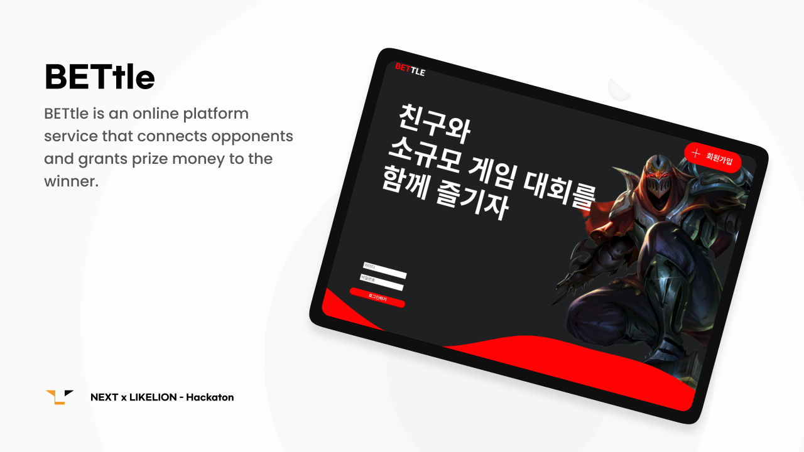<br/><br/><br/>
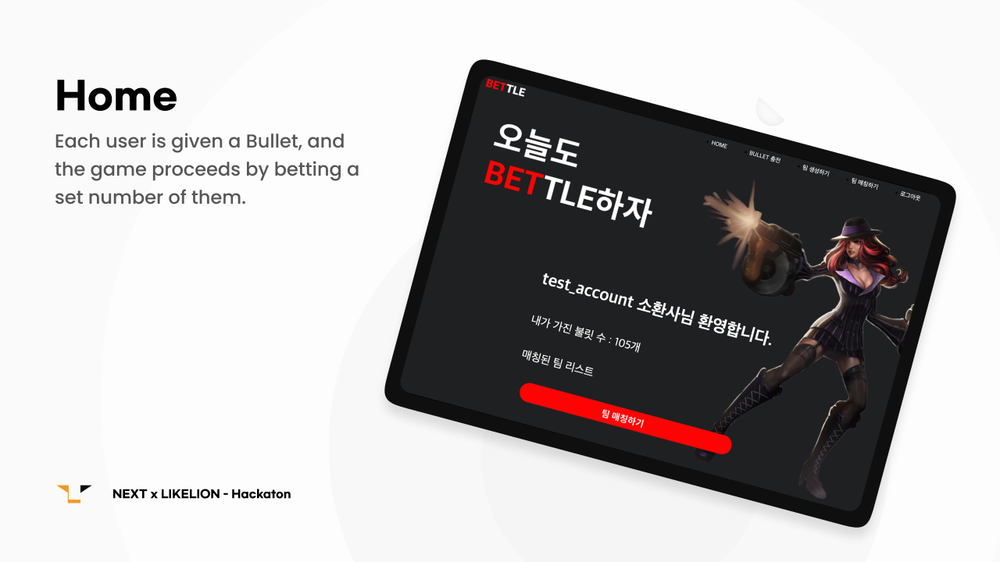<br/><br/><br/>
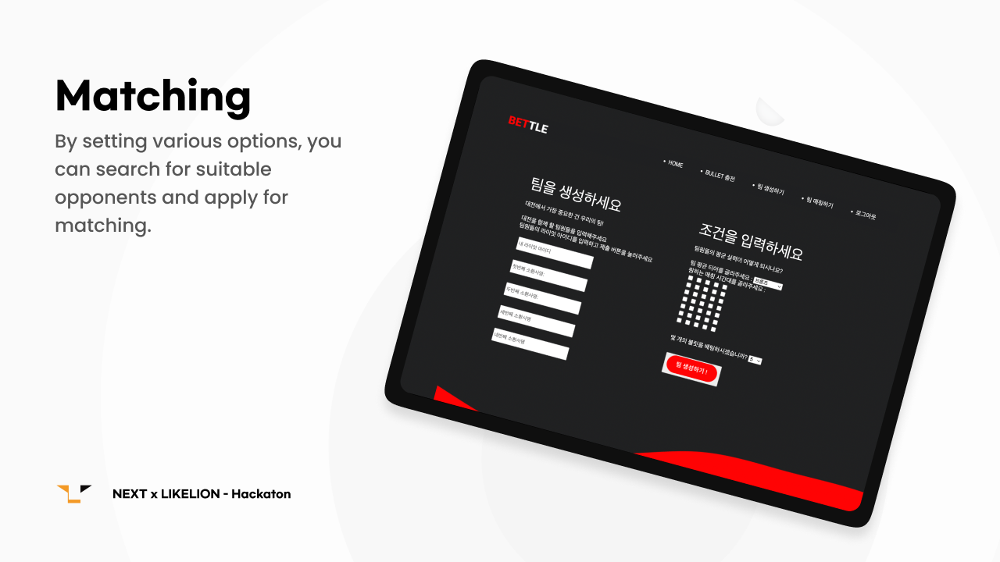<br/><br/><br/>
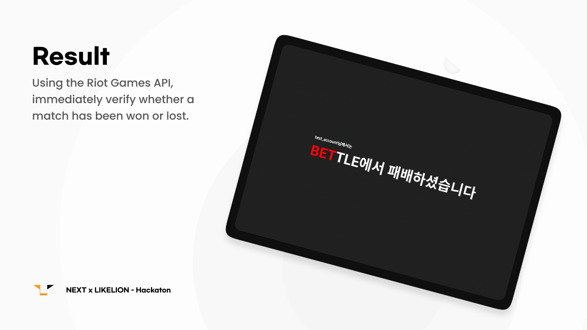<br/><br/><br/>

<!-- <div align='center'>
  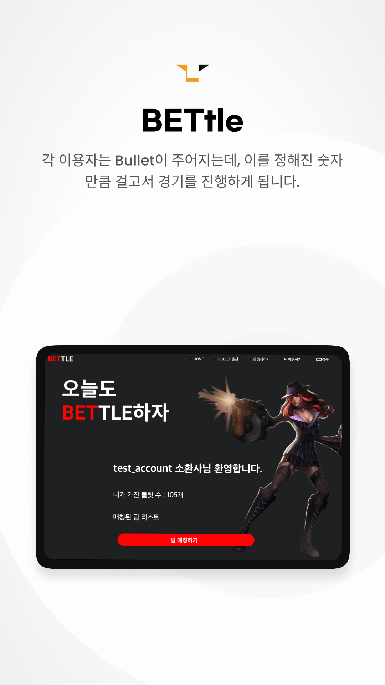
  <span>&nbsp;</span>
  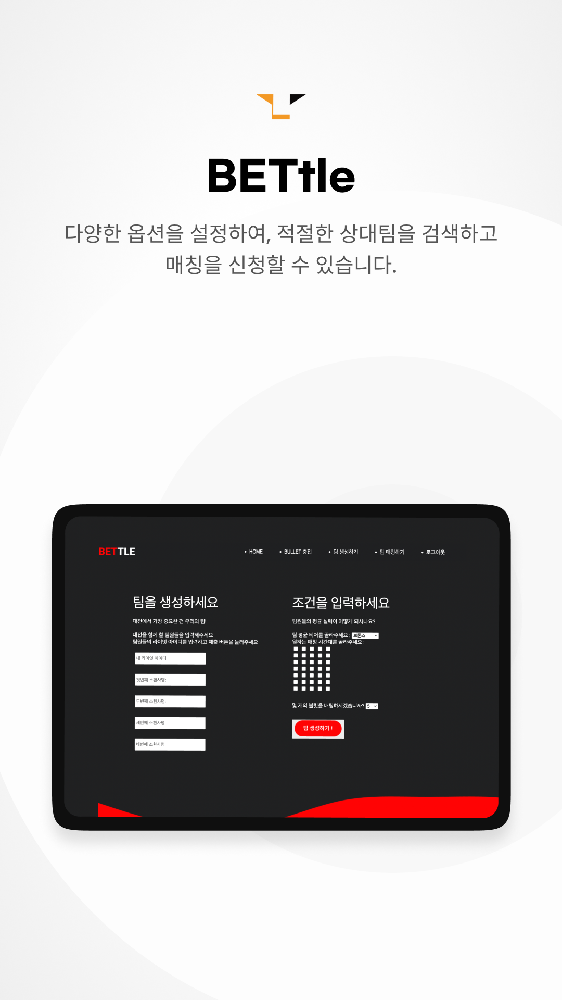
  <span>&nbsp;</span>
  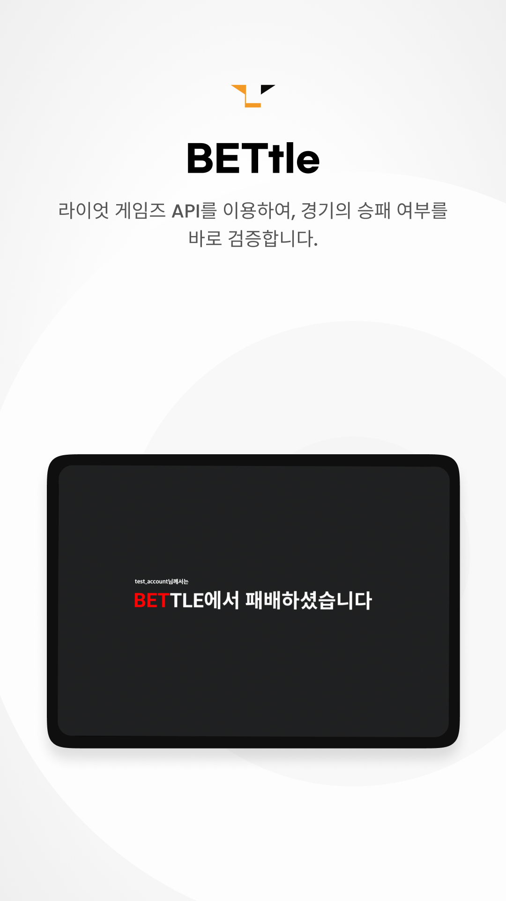
</div> -->
  
<br/><br/><br/>

# Code

```python
### Bettleproject/user/riot_api.py


# get summoner info
### /lol/summoner/v4/summoners/by-name/{summonerName}
def getSummonerInfo(DEVELOPMENTAPIKEY, summonerName):
    encodingSummonerName = parse.quote(summonerName)
    APIURL = (
        "https://kr.api.riotgames.com/lol/summoner/v4/summoners/by-name/"
        + encodingSummonerName
    )
    headers = {
        "Origin": "https://developer.riotgames.com",
        "Accept-Charset": "application/x-www-form-urlencoded; charset=UTF-8",
        "X-Riot-Token": DEVELOPMENTAPIKEY,
        "Accept-Language": "ko-KR,ko;q=0.9,en-US;q=0.8,en;q=0.7",
        "User-Agent": "{ personal user-agent }",
    }
    res = requests.get(APIURL, headers=headers)
    data = res.json()
    return data


# get user info
### /lol/league/v4/entries/by-summoner/{encryptedSummonerId}
def getUserInfo(DEVELOPMENTAPIKEY, summonerName):
    encryptedId = getSummonerInfo(DEVELOPMENTAPIKEY, summonerName)["id"]
    headers = {
        "Origin": "https://developer.riotgames.com",
        "Accept-Charset": "application/x-www-form-urlencoded; charset=UTF-8",
        "X-Riot-Token": DEVELOPMENTAPIKEY,
        "Accept-Language": "ko-KR,ko;q=0.9,en-US;q=0.8,en;q=0.7",
        "User-Agent": "Mozilla/5.0 (Macintosh; Intel Mac OS X 10_14_2) AppleWebKit/537.36 (KHTML, like Gecko) Chrome/79.0.3945.117 Safari/537.36",
    }
    APIURL = (
        "https://kr.api.riotgames.com/lol/league/v4/entries/by-summoner/" + encryptedId
    )
    res = requests.get(APIURL, headers=headers)
    data = res.json()
    return data


# get matches info
### /lol/match/v5/matches/by-puuid/{puuid}/ids
def getMatchsInfo(DEVELOPMENTAPIKEY, summonerName):
    puuid = getSummonerInfo(DEVELOPMENTAPIKEY, summonerName)["puuid"]
    headers = {
        "Origin": "https://developer.riotgames.com",
        "Accept-Charset": "application/x-www-form-urlencoded; charset=UTF-8",
        "X-Riot-Token": DEVELOPMENTAPIKEY,
        "Accept-Language": "ko-KR,ko;q=0.9,en-US;q=0.8,en;q=0.7",
        "User-Agent": "Mozilla/5.0 (Macintosh; Intel Mac OS X 10_14_2) AppleWebKit/537.36 (KHTML, like Gecko) Chrome/79.0.3945.117 Safari/537.36",
    }
    APIURL = (
        "https://asia.api.riotgames.com/lol/match/v5/matches/by-puuid/"
        + puuid
        + "/ids?start=0&count=20"
    )
    res = requests.get(APIURL, headers=headers)
    data = res.json()
    return data


# get one of matches info
### /lol/match/v5/matches/{matchId}
def getOneMatchInfo(DEVELOPMENTAPIKEY, summonerName, i):
    matchsID = getMatchsInfo(DEVELOPMENTAPIKEY, summonerName)
    headers = {
        "Origin": "https://developer.riotgames.com",
        "Accept-Charset": "application/x-www-form-urlencoded; charset=UTF-8",
        "X-Riot-Token": DEVELOPMENTAPIKEY,
        "Accept-Language": "ko-KR,ko;q=0.9,en-US;q=0.8,en;q=0.7",
        "User-Agent": "Mozilla/5.0 (Macintosh; Intel Mac OS X 10_14_2) AppleWebKit/537.36 (KHTML, like Gecko) Chrome/79.0.3945.117 Safari/537.36",
    }
    APIURL = "https://asia.api.riotgames.com/lol/match/v5/matches/" + matchsID[i]
    res = requests.get(APIURL, headers=headers)
    data = res.json()
    return data

```

<br/>

```python
### Bettleproject/user/models.py

#
from django.contrib.auth.models import User


#
class Bullet(models.Model):
    owner = models.ForeignKey(User, on_delete=models.CASCADE, related_name="bullet")
    num = models.IntegerField(default=30)

    def __str__(self):
        return self.owner.username

```

<br>


```python
### Bettleproject/user/views.py


@login_required(login_url="user/login/")
def reload_bullet(request):
    username = request.user.username
    bullet_now = Bullet.objects.get(owner__username=username)
    if request.method == "POST":
        bullet_reloaded = request.POST["bullet_reloaded"]
        num_reloaded = bullet_now.num + int(bullet_reloaded)
        Bullet.objects.update(num=num_reloaded)
        return redirect("user:home", username)
    context = {"username": username, "bullet_now": bullet_now}
    return render(request, "reload.html", context)
```

# templates

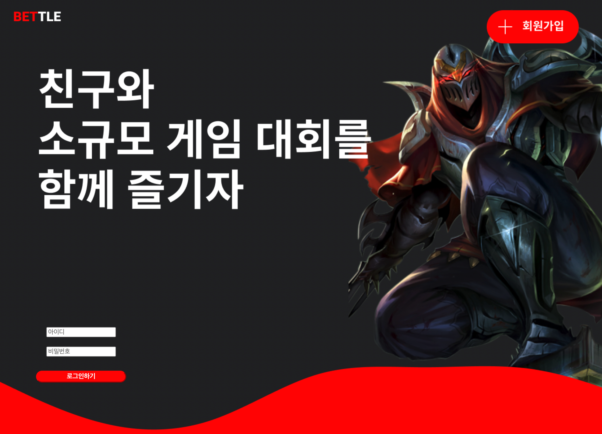<br/><br/><br/>

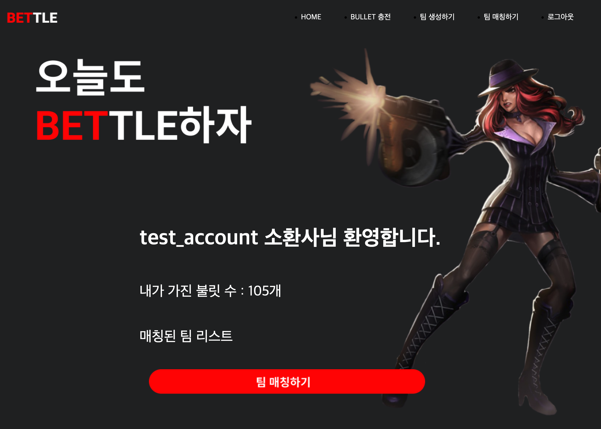<br/><br/><br/>

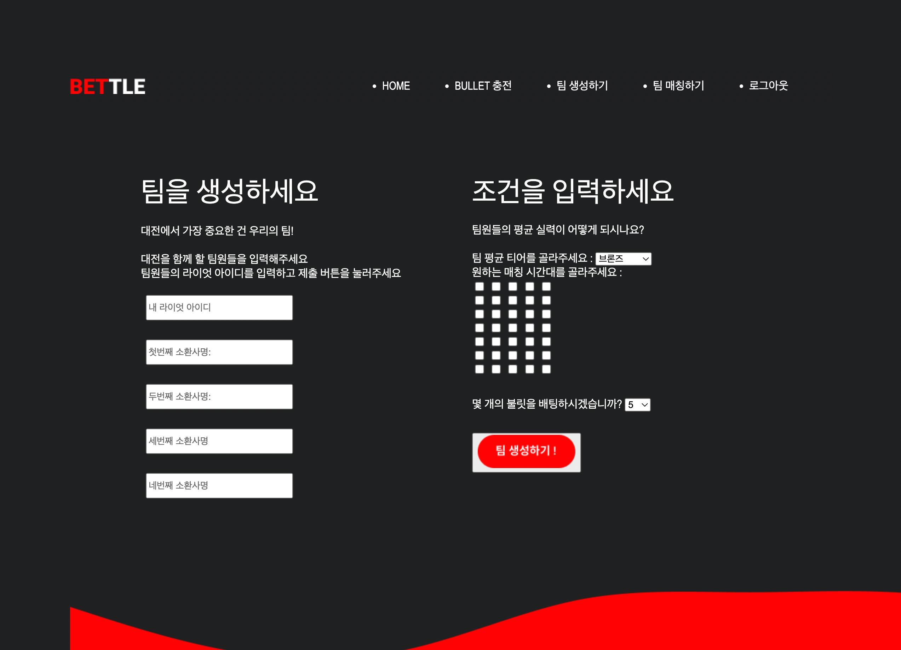<br/><br/><br/>

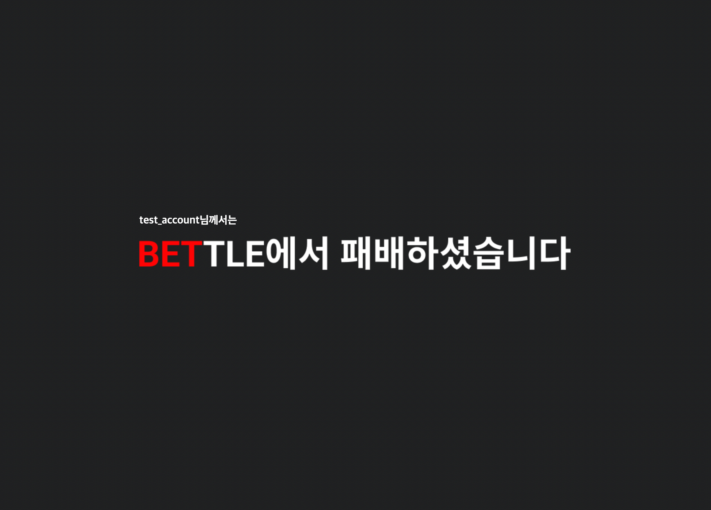<br/><br/><br/>

# Need to Improvement

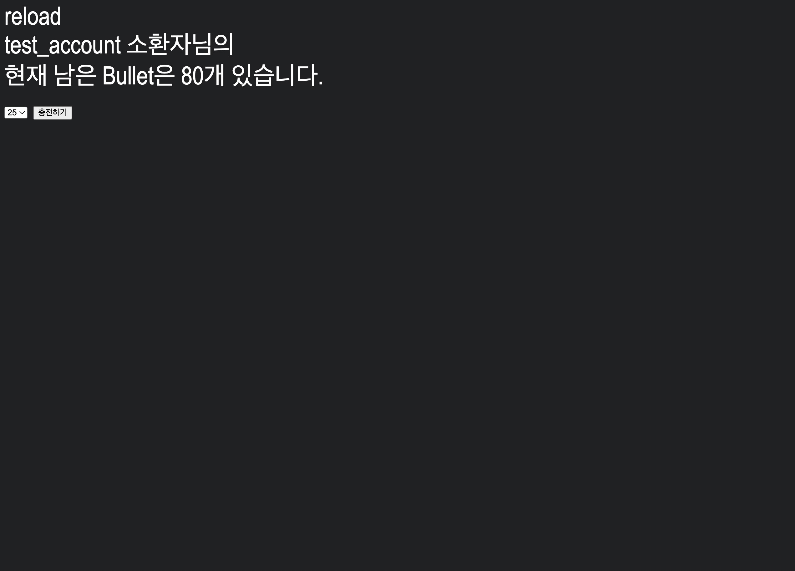<br/><br/><br/>

