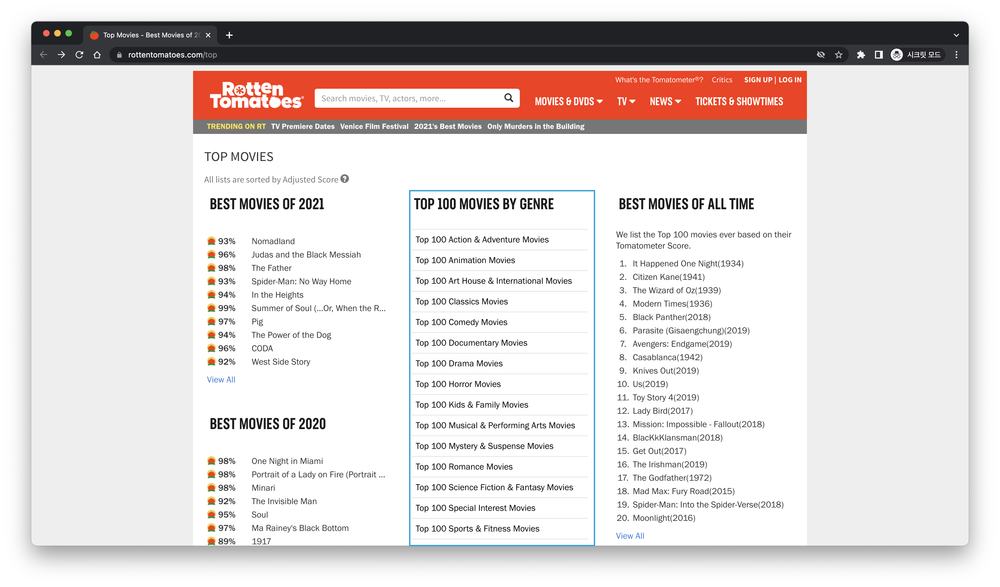
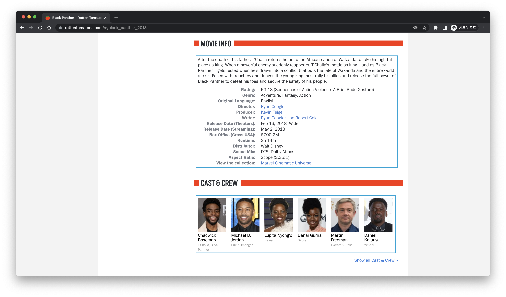

# Rottem Tomatoes

<ul>
  
<li>LECTURE : Social Media Analytics</li>
  
<li>Team : Group 6</li>

<li>LAST_MODIFICATION : 2022-4-26</li>

<li>TARGET_WEBSITE : https://www.rottentomatoes.com</li>

  
</ul>
  
 

 

<h1>FINAL PROJECT</h1>
  
<h3><strong>- BUSINESS PROBLEM -</strong></h3>
  

Movie companies need information to make decisions

 
  
<h3><strong>- HYPOTHESIS -</strong></h3>
  

<strong>"Can TOMATOMETER show meaningful linearity to sales from BOX-OFFICE"</strong>

  

If the hypothesis is accepted, movie companies need to take care of TOMATOMETER.

If the hypothesis is rejected, movie companies do not need to take care of TOMATOMETER.

 
  
## TOP 100 MOVIES BY GENRE

## TABLE OF TOP 100 MOVIES

## DETAILS OF MOVIES

