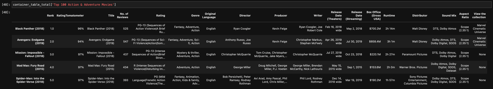
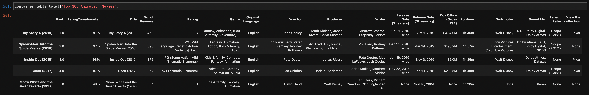
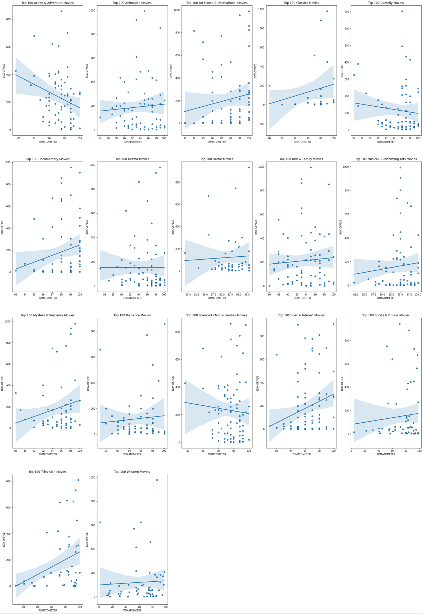
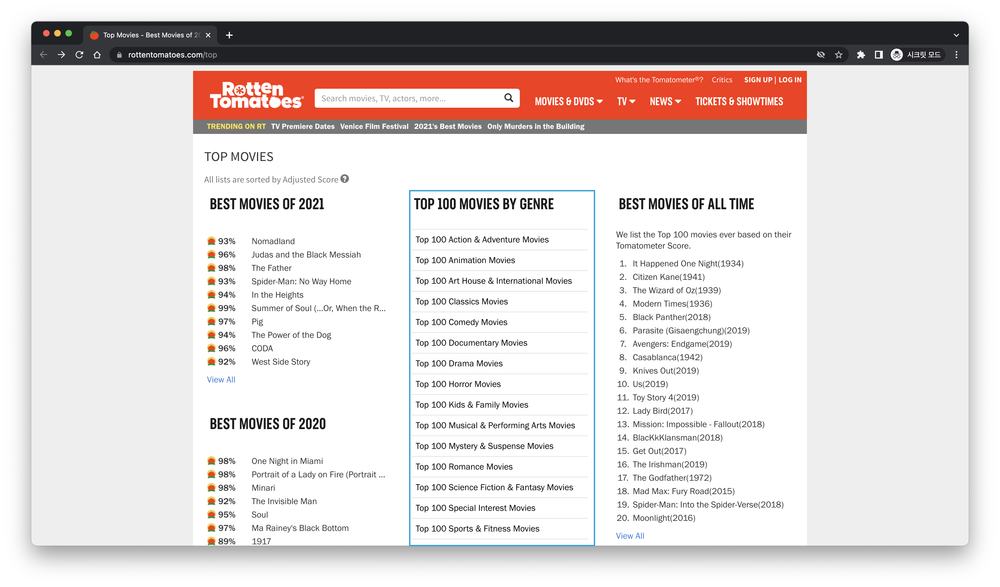
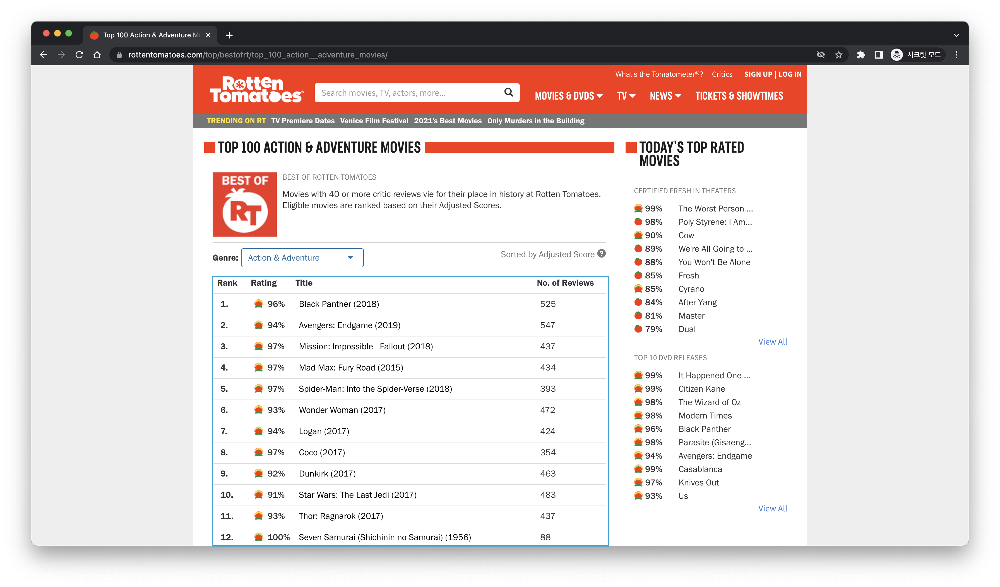

# Rottem Tomatoes

<ul>
  <li>LECTURE : Social Media Analytics</li>
  <li>Team : Group 6</li>
  <li>LAST_MODIFICATION : 2022-4-26</li>
  <li>TARGET_WEBSITE : https://www.rottentomatoes.com</li>
</ul>
  
 
 

  <h1>FINAL PROJECT</h1>
   
  
  <h3><strong>- BUSINESS PROBLEM -</strong></h3>
  
Movie companies need information to make decisions

   
  
  <h3><strong>- HYPOTHESIS -</strong></h3>
  
<strong>"Can TOMATOMETER show meaningful linearity to sales from BOX-OFFICE"</strong>

  
If the hypothesis is accepted, movie companies need to take care of TOMATOMETER.

  
If the hypothesis is rejected, movie companies do not need to take care of TOMATOMETER.

   
  
  <h3><strong>- SCRIPT -</strong></h3>
  
<strong>Requests, Selenium, Pandas</strong>

  
Top 100 movies in 17 Genres are crawled and built into DataFrame.

  
Requests and Selenium are used in parallel to shorten running-time.

  
  
  
Check -> https://github.com/ziweek/rotten_tomatoes/blob/main/crawler.ipynb

   
  
   <h3><strong>- VISUALIZATION -</strong></h3>
  
<strong>Matplotlib, SEABORN</strong>

  
Scatter plots

  
  
Check -> https://github.com/ziweek/rotten_tomatoes/blob/main/al.ipynb

 
  
## TOP 100 MOVIES BY GENRE

The blue rectangle on screenshots is crawled.

## TABLE OF TOP 100 MOVIES

The blue rectangle on screenshots is crawled.

## DETAILS OF MOVIES

The blue rectangle on screenshots is crawled.

